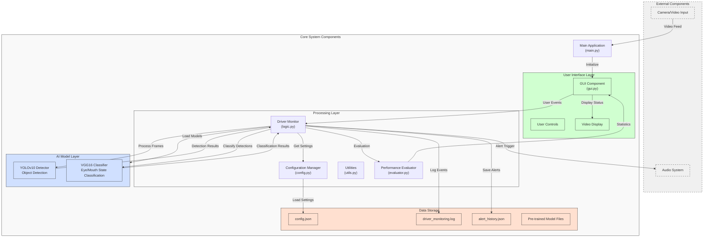

# Driver Monitoring System Architecture

## System Architecture Diagram

## Components Description

### External Components
- **Camera/Video Input**: Provides real-time video stream or recorded video for analysis.
- **Audio System**: Plays alert sounds when drowsiness is detected.

### Core System Components

#### User Interface Layer
- **GUI Component (gui.py)**: Implements the Tkinter-based user interface.
- **User Controls**: Buttons and controls for user interaction.
- **Video Display**: Area to show processed video with annotations.

#### Processing Layer
- **Driver Monitor (logic.py)**: Core component managing drowsiness detection logic.
- **Configuration Manager (config.py)**: Handles loading and managing system configuration.
- **Utilities (utils.py)**: Helper functions for preprocessing, logging, etc.
- **Performance Evaluator (evaluator.py)**: Evaluates system performance against ground truth data.

#### AI Model Layer
- **YOLOv10 Detector**: Object detection model to locate eyes and mouth.
- **VGG16 Classifier**: Deep learning classifier to determine eye and mouth states.

#### Data Storage
- **config.json**: Stores system configuration parameters.
- **driver_monitoring.log**: Log file for system events and diagnostics.
- **alert_history.json**: Records detected drowsiness alerts.
- **Pre-trained Model Files**: YOLOv10 and VGG16 model weights.

## Data Flow

1. Video input from camera or file is received by the main application.
2. Frames are processed by the Driver Monitor component.
3. YOLOv10 detects eye and mouth regions in each frame.
4. VGG16 classifies the state of detected eyes (open/closed) and mouth (yawn/no yawn).
5. Driver Monitor analyzes these states over time to detect drowsiness patterns.
6. When drowsiness is detected, alerts are triggered and saved to alert history.
7. The GUI displays the processed video with annotations and system status.
8. (Optional) Performance Evaluator compares detection results with ground truth data.

## Implementation Details

The system uses a modular architecture to separate concerns:
- The GUI layer handles user interaction and display.
- The processing layer manages core logic and system coordination.
- The AI model layer provides detection and classification capabilities.
- The storage layer maintains configuration, history, and logging data.

This architecture enables:
- Easy maintenance and updates to individual components
- Separation of AI models from business logic
- Flexible configuration through external files
- Performance evaluation capabilities for testing and validation